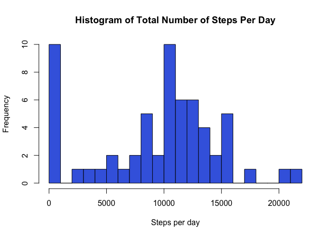
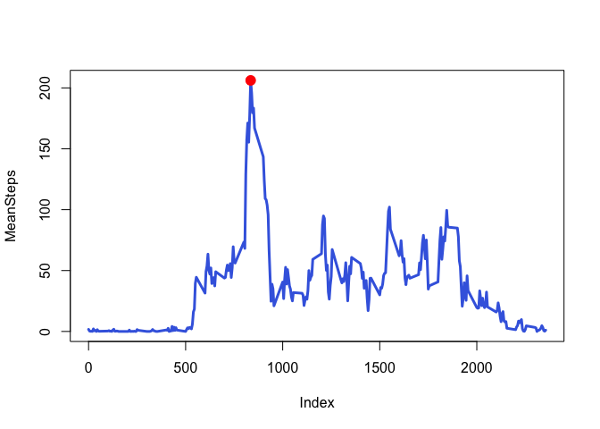
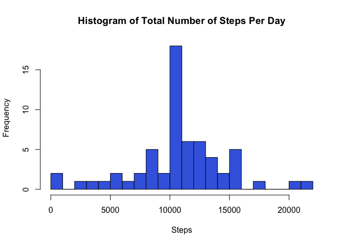
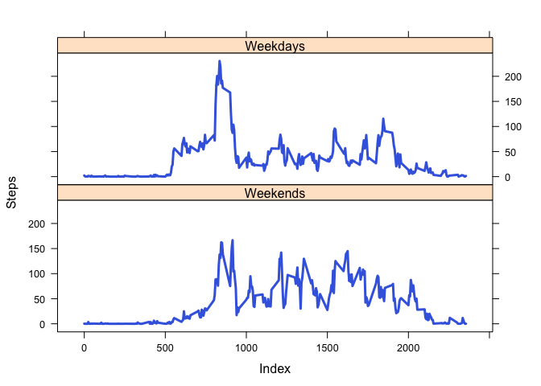

# Reproducible Research: Peer Assessment 1
## Loading and preprocessing the data

```r
echo = TRUE 
data <- read.csv("activity.csv")
```

## What is mean total number of steps taken per day?


```r
sum_data  <- tapply(data$steps, data$date, sum, na.rm=TRUE)
hist(sum_data, breaks=30, col = "royalblue", main = "Histogram of Total Number of Steps Per Day", xlab="Steps per day")
```

 

* Average step per day:

```r
ave_data <- mean(sum_data, na.rm=TRUE)
ave_data
```

```
## [1] 9354.23
```
* Step median per day:

```r
median_data  <- median(sum_data, na.rm=TRUE)
median_data
```

```
## [1] 10395
```

## What is the average daily activity pattern?
* The average steps taken per day on a per 5-min basis

```r
agg_data <- aggregate(data$steps, by=list(as.numeric(as.character(data$interval))), FUN=mean, na.rm=T)
names(agg_data)[1] <- "Index"
names(agg_data)[2] <- "MeanSteps"
```
* Time-series plot including the point highlighting the max number of steps

```r
plot(agg_data, type = "l", col = "royalblue", lwd=3)
max_ind <- which(agg_data$MeanSteps==max(agg_data$MeanSteps))
points(agg_data[max_ind,], col="red", pch=19, cex = 1.5)
```

 

* The following 5-min interval contains the maximum number of steps:

```r
agg_data[max_ind,]
```

```
##     Index MeanSteps
## 104   835  206.1698
```

## Imputing missing values
* The number of missing values is:

```r
sum(is.na(data))
```

```
## [1] 2304
```
* Replace missing data with average step value from the same 5-minute interval

```r
new_data <- data 
# iterate over each row the new data and replace the missing value accordingly
for (i in 1:nrow(new_data)) {
  if (is.na(new_data$steps[i])) {
    new_data$steps[i] <- agg_data$MeanSteps[which(new_data$interval[i] == agg_data$Index)]
  }
}
sum(is.na(new_data))
```

```
## [1] 0
```

```r
sum_new_data  <- tapply(new_data$steps, new_data$date, sum, na.rm=TRUE)
hist(sum_new_data, breaks=30, col = "royalblue", main = "Histogram of Total Number of Steps Per Day", xlab="Steps")
```

 

* Compare average steps from the original and new dataset

```r
new_mean <- mean(sum_new_data, na.rm=TRUE)
new_mean - ave_data
```

```
## [1] 1411.959
```
* Compare step medians from the original and new dataset

```r
new_median <- median(sum_new_data, na.rm=TRUE)
new_median - median_data
```

```
## [1] 371.1887
```
##### The average and median values from the new dataset differ from those from the old one. It is apparent that replacing of missing values creates a new and independent dataset. Therefore, the resulted average and median values shall be different.

## Are there differences in activity patterns between weekdays and weekends?
* Data preparations

```r
# convert into date format
new_data$date <- as.Date(new_data$date, format = "%Y-%m-%d")
# lookup table for weekdays
weekdays_lookup <- c('Monday', 'Tuesday', 'Wednesday', 'Thursday', 'Friday')
# add a factor attribute (column) to the new data
new_data$factor <- factor((weekdays(new_data$date) %in% weekdays_lookup), levels=c(FALSE, TRUE), labels=c('Weekends', 'Weekdays') )
```
* Calculate average steps based on per 5-min interval and weekday/weekend basis

```r
new_agg_data <-aggregate(new_data$steps, by=list(new_data$interval, new_data$factor), FUN=mean, na.rm=TRUE)
names(new_agg_data)[1] <- "Index"
names(new_agg_data)[2] <- "Weekdays"
names(new_agg_data)[3] <- "MeanSteps"
```
* Lattice plot

```r
library(lattice)
xyplot(new_agg_data$MeanSteps ~ new_agg_data$Index | new_agg_data$Weekdays, type = "l", layout = c(1, 2), col= 'royalblue', lwd=3, xlab ="Index", ylab = "Steps")
```

 
