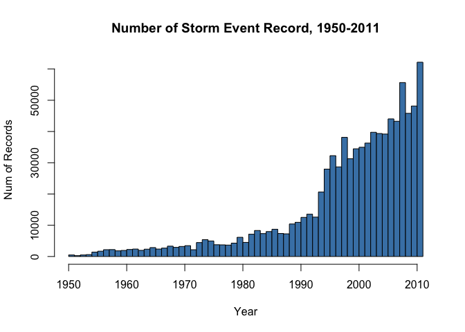
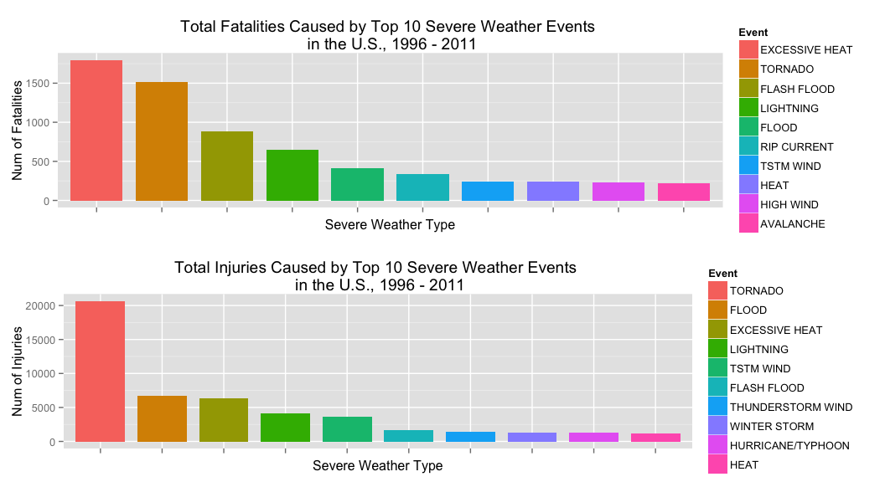
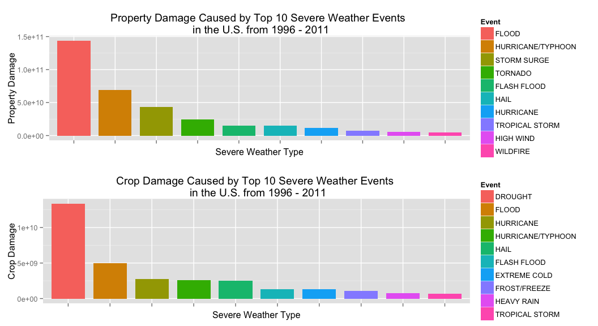

# Reproducible Research: Peer Assessment 2
Created by Kun Zhu on Aug 23rd, 2015

## Severe Weather Event Impact on Society 
### - Population Health and Economic Consequences, the U.S., 1996 - 2011

### Synopsis
This report provides a high level summary of the damage caused by severe weather events in the U.S. 
Specially, the number of injuries and fatalities and damage (in $) on properties and crops are examined. The original data is from the NAtional Oceanic and Atmospheric Administration and includes records from 1950 to 2011. Records from the early years, i.e., before 1996, are incomplete, therefore, this report focus on the data between 1996 and 2011. This study suggests excessive heat,  tornado, and flood are the major threats to population health, while flood, drought, and hurricane/typhoon have the greatest economic consequences.

### Data processing
* Load and overview the orignal dataset

```r
library(ggplot2)
```

```
## Warning: package 'ggplot2' was built under R version 3.1.3
```

```r
library(gridExtra)
```

```
## Loading required package: grid
```

```r
cache = TRUE
stormData <- read.csv("repdata_data_StormData.csv")
stormData$year <- as.numeric(format(as.Date(stormData$BGN_DATE, format = "%m/%d/%Y %H:%M:%S"), "%Y"))
hist(stormData$year, breaks = 60, col= "steelblue", xlab="Year", ylab="Num of Records", main = "Number of Storm Event Record, 1950-2011")
```

 

As the dataset from the recent years is more complete, this report focuses on statistics from the recent 15 years, i.e., 1996-2011.

* Subset data from 1996

```r
cache = TRUE
subsetData <- subset(stormData, year > 1995)
```
The property damage and crop damage data are updated with their corresponding unit multipliers from PROPDMGEXP and CROPDMGEXP columns.

* List the units from PROPDMGEXP and convert them to numerics

```r
cache = TRUE
unique(subsetData$PROPDMGEXP)
```

```
## [1] K   M B 0
## Levels:  - ? + 0 1 2 3 4 5 6 7 8 B h H K m M
```

```r
subsetData[subsetData$PROPDMGEXP == "H", ]$PROPDMG <- subsetData[subsetData$PROPDMGEXP == "H", ]$PROPDMG * 10^2
subsetData[subsetData$PROPDMGEXP == "h", ]$PROPDMG <- subsetData[subsetData$PROPDMGEXP == "h", ]$PROPDMG * 10^2
subsetData[subsetData$PROPDMGEXP == "K", ]$PROPDMG <- subsetData[subsetData$PROPDMGEXP == "K", ]$PROPDMG * 10^3
subsetData[subsetData$PROPDMGEXP == "M", ]$PROPDMG <- subsetData[subsetData$PROPDMGEXP == "M", ]$PROPDMG * 10^6
subsetData[subsetData$PROPDMGEXP == "m", ]$PROPDMG <- subsetData[subsetData$PROPDMGEXP == "m", ]$PROPDMG * 10^6
subsetData[subsetData$PROPDMGEXP == "B", ]$PROPDMG <- subsetData[subsetData$PROPDMGEXP == "B", ]$PROPDMG * 10^9
```
* List the units from CROPDMGEXP and convert them to numerics

```r
cache = TRUE
unique(subsetData$CROPDMGEXP)
```

```
## [1] K   M B
## Levels:  ? 0 2 B k K m M
```

```r
subsetData[subsetData$CROPDMGEXP == "K", ]$CROPDMG <- subsetData[subsetData$CROPDMGEXP == "K", ]$CROPDMG * 10^3
subsetData[subsetData$CROPDMGEXP == "k", ]$CROPDMG <- subsetData[subsetData$CROPDMGEXP == "k", ]$CROPDMG * 10^3
subsetData[subsetData$CROPDMGEXP == "M", ]$CROPDMG <- subsetData[subsetData$CROPDMGEXP == "M", ]$CROPDMG * 10^6
subsetData[subsetData$CROPDMGEXP == "m", ]$CROPDMG <- subsetData[subsetData$CROPDMGEXP == "m", ]$CROPDMG * 10^6
subsetData[subsetData$CROPDMGEXP == "B", ]$CROPDMG <- subsetData[subsetData$CROPDMGEXP == "B", ]$CROPDMG * 10^9
```

### Severe weather event impact on population health
* Top 10 severe weather events for fatalities

```r
# Aggregate, subset and sort the dataset 
fatalitiesData <- aggregate(subsetData$FATALITIES, by=list(subsetData$EVTYPE), FUN=sum, na.rm=T)
names(fatalitiesData)[1] <- "Event"
names(fatalitiesData)[2] <- "Fatality"
sortedFatalities <-head(fatalitiesData[order(-fatalitiesData$Fatality),], 10)
sortedFatalities$Rank <-1:10
sortedFatalities <- sortedFatalities[c(3,1,2)]
sortedFatalities
```

```
##     Rank          Event Fatality
## 81     1 EXCESSIVE HEAT     1797
## 426    2        TORNADO     1511
## 98     3    FLASH FLOOD      887
## 224    4      LIGHTNING      651
## 102    5          FLOOD      414
## 300    6    RIP CURRENT      340
## 434    7      TSTM WIND      241
## 147    8           HEAT      237
## 177    9      HIGH WIND      235
## 16    10      AVALANCHE      223
```
* Top 10 severe weather events for injuries

```r
# Aggregate, subset and sort the dataset 
injuriesData <- aggregate(subsetData$INJURIES, by=list(subsetData$EVTYPE), FUN=sum, na.rm=T)
names(injuriesData)[1] <- "Event"
names(injuriesData)[2] <- "Injury"
sortedInjuries <- head(injuriesData[order(-injuriesData$Injury),], 10)
sortedInjuries$Rank <-1:10
sortedInjuries <- sortedInjuries[c(3,1,2)]
sortedInjuries
```

```
##     Rank             Event Injury
## 426    1           TORNADO  20667
## 102    2             FLOOD   6758
## 81     3    EXCESSIVE HEAT   6391
## 224    4         LIGHTNING   4141
## 434    5         TSTM WIND   3629
## 98     6       FLASH FLOOD   1674
## 421    7 THUNDERSTORM WIND   1400
## 507    8      WINTER STORM   1292
## 185    9 HURRICANE/TYPHOON   1275
## 147   10              HEAT   1222
```

```r
cache = TRUE
sortedInjuries <- transform(sortedInjuries, Event = reorder(Event, -Injury))
injuryPlot <- ggplot(sortedInjuries, aes(x=Event, y=Injury, fill=Event)) + 
  geom_bar(stat = "identity", width=.8) + 
  theme(axis.text.x=element_blank()) + 
  xlab("Severe Weather Type") + 
  ylab("Num of Injuries") +  
  ggtitle("Total Injuries Caused by Top 10 Severe Weather Events \n in the U.S., 1996 - 2011")

sortedFatalities <- transform(sortedFatalities, Event = reorder(Event, -Fatality))
fatalityPlot <- ggplot(sortedFatalities, aes(x=Event, y=Fatality, fill=Event)) + 
  geom_bar(stat = "identity", width=.8) + 
  theme(axis.text.x=element_blank()) + 
  xlab("Severe Weather Type") + 
  ylab("Num of Fatalities") +  
  ggtitle("Total Fatalities Caused by Top 10 Severe Weather Events \n in the U.S., 1996 - 2011")

grid.arrange(fatalityPlot, injuryPlot, nrow = 2)
```

 

### Damage on property and crop due to sever weather events
* Top 10 severe weather events for property damage

```r
# Aggregate, subset and sort the dataset 
propDmg <- aggregate(subsetData$PROPDMG, by=list(subsetData$EVTYPE), FUN=sum, na.rm=T)
names(propDmg)[1] <- "Event"
names(propDmg)[2] <- "PropDMG"
sortedpropDmg <-head(propDmg[order(-propDmg$PropDMG),], 10)
sortedpropDmg$Rank <-1:10
sortedpropDmg <- sortedpropDmg[c(3,1,2)]
sortedpropDmg
```

```
##     Rank             Event      PropDMG
## 102    1             FLOOD 143944833550
## 185    2 HURRICANE/TYPHOON  69305840000
## 342    3       STORM SURGE  43193536000
## 426    4           TORNADO  24616945710
## 98     5       FLASH FLOOD  15222203910
## 142    6              HAIL  14595143420
## 183    7         HURRICANE  11812819010
## 430    8    TROPICAL STORM   7642475550
## 177    9         HIGH WIND   5247860360
## 496   10          WILDFIRE   4758667000
```
* Top 10 severe weather events for crop damage

```r
# Aggregate, subset and sort the dataset 
cropDmg <- aggregate(subsetData$CROPDMG, by=list(subsetData$EVTYPE), FUN=sum, na.rm=T)
names(cropDmg)[1] <- "Event"
names(cropDmg)[2] <- "CropDMG"
sortedcropDmg <-head(cropDmg[order(-cropDmg$CropDMG),], 10)
sortedcropDmg$Rank <-1:10
sortedcropDmg <- sortedcropDmg[c(3,1,2)]
sortedcropDmg 
```

```
##     Rank             Event     CropDMG
## 63     1           DROUGHT 13367566000
## 102    2             FLOOD  4974778400
## 183    3         HURRICANE  2741410000
## 185    4 HURRICANE/TYPHOON  2607872800
## 142    5              HAIL  2476029450
## 98     6       FLASH FLOOD  1334901700
## 89     7      EXTREME COLD  1288973000
## 122    8      FROST/FREEZE  1094086000
## 154    9        HEAVY RAIN   728169800
## 430   10    TROPICAL STORM   677711000
```

```r
sortedpropDmg <- transform(sortedpropDmg, Event = reorder(Event, -PropDMG))
propPlot <- ggplot(sortedpropDmg, aes(x=Event, y=PropDMG, fill=Event)) + 
  geom_bar(stat = "identity", width=.8) + 
  theme(axis.text.x=element_blank()) + 
  xlab("Severe Weather Type") + 
  ylab("Property Damage") +  
  ggtitle("Property Damage Caused by Top 10 Severe Weather Events \n in the U.S. from 1996 - 2011")

sortedcropDmg <- transform(sortedcropDmg, Event = reorder(Event, -CropDMG))
cropPlot <- ggplot(sortedcropDmg, aes(x=Event, y=CropDMG, fill=Event)) + 
  geom_bar(stat = "identity", width=.8) + 
  theme(axis.text.x=element_blank()) + 
  xlab("Severe Weather Type") + 
  ylab("Crop Damage") +  
  ggtitle("Crop Damage Caused by Top 10 Severe Weather Events \n in the U.S. from 1996 - 2011")

grid.arrange(propPlot, cropPlot, nrow = 2)
```

 

### Conclusion
This study suggests that excessive heat, tornato, and flood place the greatest threats to population healty in the U.S. From a economic point of view, flood, hurrican/typhoon, and droughts are the major causes of property and crop damage. 

