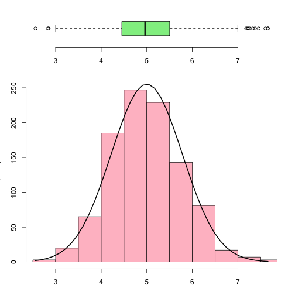

Asymptotical Phenomena
========================================================
author: Kun Zhu
date: 5/30/2016

Summary
========================================================

- The purpose of this project assignment is to demonstrate of asymptotical phenomena of a
exponential distribution with a certain size.
- The work is adapted from the project assignment of the course Statistical Inference on Coursera

Three Parameters
========================================================
- A sample distribution is created given the specified number of averages from an exponential distribution
- the theoretical mean and standard deviation from studied exponential distribution are calculated from the specified lambda
- the theoritical mean and standard deviation are compared with empirical mean and standard deviation of the sample distribution

Example
========================================================
An example with a sample distribution includes a thousand averages from 40 samples from the studied
exponential distribution. The histogram and box plot of the sample distribution are presented in the next slide

Example Plot
========================================================

Conclusion
========================================================
It is apparent that the histogram of the sample distribution follows the pattern of the plotted normal
distribution.
